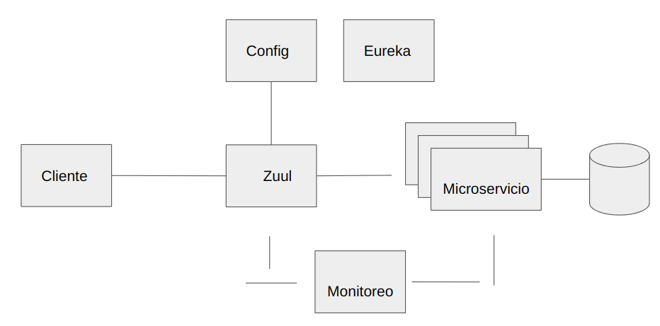

# Taller Spring Cloud

El objetivo de nuestro taller es tener una prueba de contacto con la orquestación
de microservicios utilizado la suite de herramientas de la plataforma
Spring Boot y Netflix OSS. El taller requiere conocimientos de la plataforma Java,
 manejo de Git y nociones en implementaciones de software de forma distruida.
 Los conceptos relacionados a una arquitectura basada en 
 microservicios serán abordados en el taller.
 
 ## Marco Conceptual - MicroServicios
 
 Ver la presentación -> [Ir a Presentación](https://docs.google.com/presentation/d/1K7NClwUr06h8wh7SErEBe7laRHzv1g31lr8PwGtEGiU/edit?usp=sharing)

 ## Estructura Implementada



 ## Servicios Implementados

Estaremos configurando los siguientes servicios:

* ELK Stack.
* Servidor de Configuración.
* Servidor de AutoDescubrimiento.
* Servidor Perimetral.
* Micro Servicio Demo.
* Agregando funcionalidad de Circuit Breaker.
* Monitoreo de las Aplicaciones.
* Cliente - Prueba de los conceptos.

## Estructura del Taller

Cada servicio que estaremos implementando está definido por una carpeta:
* inicio: Contiene un proyecto base con el que vamos a trabajar.
* final: Contiene el proyecto luego de realizar el laboratorio.  

Puede utiliza el IDE de su preferencia, todos los proyectos utilizan Gradle.

## Implementación de los Servicios

### Inicio Servicios ELK (Elasticsearch, Logstash y Kibana)

ELK,son un conjunto de servicios que nos permiten centralizar los logs de nuestras aplicaciones.

* Elasticsearch: Servicio de indexación.
* Logstash: Servicio para extraer los logs, transformar y enviar al servidor Elasticsearch.
* Kibana: Servicio para visualizar los logs almacenados.

Para arrancar el servicio para la centralización de los log. 

**Creación Red Docker**
```
docker network create elk
```

**Elasticsearch**
```
docker run --name elasticsearch --network elk --rm -p 9200:9200 -p 9300:9300 -e "discovery.type=single-node" docker.elastic.co/elasticsearch/elasticsearch:7.8.1
```

**Kibana**
```
docker run --name kibana --network elk --rm -p 5601:5601 docker.elastic.co/kibana/kibana:7.8.1
```

**Logstash**

Moverse a la carpeta donde clonada:
```
cd taller-spring-cloud
```
Ejecutar el siguiente comando:
```
docker run --name logstash --network elk --rm -it -p 5044:5044 -v ./archivos-configuracion/logstash/:/usr/share/logstash/pipeline/ docker.elastic.co/logstash/logstash:7.8.1
```

### Servidor de Configuración

Cuando tenemos una arquitectura que depende de varios
procesos trabajando de forma coordinada, es importante contar con la funcionalidad
de centralizar las configuraciones y permitir la actualización de esos parámetros
en caliente. Para nuestro ejemplo abrir el proyecto **servidor-configuracion** en la carpeta inicio.  
Notar las dependencias que están agregadas en el archivo **build.gradle** :
     
```
implementation 'org.springframework.boot:spring-boot-starter-actuator'
implementation 'org.springframework.cloud:spring-cloud-config-server'
```
En el archivo **ServidorConfigApplication.java** incluir la notación **@EnableConfigServer** como se muestra:

```
package edu.pucmm.servidorconfig;

import org.springframework.boot.SpringApplication;
import org.springframework.boot.autoconfigure.SpringBootApplication;
import org.springframework.cloud.config.server.EnableConfigServer;

@EnableConfigServer
@SpringBootApplication
public class ServidorConfigApplication {

    public static void main(String[] args) {
        SpringApplication.run(ServidorConfigApplication.class, args);
    }

}
```

En el archivo de propiedad **application.properties** ubicando es necesario incluir 
la siguiente información:

```
#Archivo configuración del Servidor de Configuración de Spring Cloud.
#Puerto del servicio.
server.port=8888

# Configurando la ruta donde están ubicados los archivos centralizados.
# Configuración local
spring.cloud.config.server.native.search-locations=/home/vacax/Proyectos/Github/vacax/taller-spring-cloud/archivos-configuracion/final/
spring.cloud.config.server.bootstrap=true
spring.profiles.active=native

# Configuración desde una servidor Git
# spring.cloud.config.server.git.uri=
```

Notar que dependiendo la configuración, es necesario indicar la carpeta la configuración
donde se estarán almacenando las configuraciones de los proyectos,
podemos utilizar una uri remota, referenciando a un repositorio en Git indicada en el 
archivo de propiedades. Para el taller estaremos utilizando un directorio local.
Una vez indicado los parámetros más arriba, procedemos a subir el servicio.

### Servidor de AutoDescubrimiento basado en Eureka.

TODO Argumento.

Para implementar un servicio de autodescubrimiendo, estaremos utilizando la funcionalidad
disponible en la librería de Eureka. Para trabajar en el proyecto **servidor-eureka**, 
ver la dependencia que estamos agregando en el proyecto en el archivo **build.gradle**
 
```
//librería para las metricas
    implementation 'org.springframework.boot:spring-boot-starter-actuator'

    //librería necesaria para aplicar el autodescubrimiento.
    implementation 'org.springframework.cloud:spring-cloud-starter-netflix-eureka-server'

    //librería necesaria para utilizar el servidor para centralizar la configuracion
    implementation 'org.springframework.cloud:spring-cloud-starter-config'
```

En la clase Main, **ServidorEurekaApplication***, debemos de habilitar la funcionalidad 
de Eureka:

```
package edu.pucmm.servidoreureka;

import org.springframework.boot.SpringApplication;
import org.springframework.boot.autoconfigure.SpringBootApplication;
import org.springframework.cloud.netflix.eureka.server.EnableEurekaServer;

@EnableEurekaServer
@SpringBootApplication
public class ServidorEurekaApplication {

    public static void main(String[] args) {
        SpringApplication.run(ServidorEurekaApplication.class, args);
    }

}
```

El servidor Eureka estará utilizando el servidor de centralización de configuración,
donde tenemos que crear en la carpeta **resources**, el archivo **bootstrap.properties**
que se activa en la fase de arranque de la aplicación, previo al **application.properties**,
ver las configuración:  
**bootstrap.properties**
```
# Archivo para indicar la configuración de centralizacion.
spring.application.name= servidor-eureka
spring.cloud.config.uri= http://localhost:8888/
spring.cloud.config.fail-fast=true
```  
**application.properties**
```
 # Configuracion varias
 eureka.client.register-with-eureka=false
 eureka.client.fetch-registry=false
 
 logging.level.com.netflix.eureka=OFF
 logging.level.com.netflix.discovery=OFF

```  
  
Es necesario crear el achivo de configuración, según el nombre indicando en la propiedad
**spring.application.name**, en la carpeta donde estamos centralizando la configuración,
el archivo debe llamarse **servidor-eureka.properties**, en dicho archivo incluir la siguiente
información:  
```
#Indicando el puerto que estará utilizando al aplicación
server.port = 8761

# Exponiendo los endpoints
management.endpoints.web.exposure.include=*

eureka.client.register-with-eureka=false
eureka.client.fetch-registry=false

logging.level.com.netflix.eureka=OFF
logging.level.com.netflix.discovery=OFF


```     
Arracamos el servicio y en este punto podemos ir a las siguientes URL:
[Ir al Dashboard de Eureka](http://localhost:8761)  
Validar que la configuración está centralizada [http://localhost:8888/servidor-eureka/default](http://localhost:8888/servidor-eureka/default)

### Microservicio Estudiante (Aplicación de prueba)

TODO Argumentar....

Para implementar un Micro Servicio, estaremos utilizando los módulos disponible 
disponible en Spring Boot. Para trabajar en el proyecto ir **microservicio-estudiante**, 
ver la dependencia que estamos agregando en el proyecto en el archivo **build.gradle**
 
```
//Librerías Web
    implementation 'org.springframework.boot:spring-boot-starter-actuator'
    implementation 'org.springframework.boot:spring-boot-starter-data-jpa'
    implementation 'org.springframework.boot:spring-boot-starter-web'
    //Librería para centralizar la configuración.
    implementation 'org.springframework.cloud:spring-cloud-starter-config'
    //Librería para agregar la notificación con Eureka.
    implementation 'org.springframework.cloud:spring-cloud-starter-netflix-eureka-client'
    //Libreria para la caja de breaker
    implementation 'org.springframework.cloud:spring-cloud-starter-netflix-hystrix'
```                                                                                

En la clase Main, **MicroservicioEstudianteApplication***, debemos de habilitar los 
diferentes módulos para permitir mantener un proceso:

```
package edu.pucmm.microservicioestudiante;

import com.netflix.hystrix.contrib.javanica.annotation.HystrixCommand;
import com.netflix.hystrix.contrib.javanica.annotation.HystrixProperty;
import org.springframework.beans.factory.annotation.Autowired;
import org.springframework.boot.SpringApplication;
import org.springframework.boot.autoconfigure.SpringBootApplication;
import org.springframework.cloud.client.circuitbreaker.EnableCircuitBreaker;
import org.springframework.cloud.client.discovery.EnableDiscoveryClient;
import org.springframework.cloud.netflix.hystrix.EnableHystrix;
import org.springframework.data.jpa.repository.JpaRepository;
import org.springframework.http.MediaType;
import org.springframework.stereotype.Repository;
import org.springframework.web.bind.annotation.*;

import javax.persistence.Entity;
import javax.persistence.Id;
import javax.servlet.http.HttpServletRequest;
import java.io.Serializable;
import java.util.List;
import java.util.Random;

@EnableDiscoveryClient
@EnableCircuitBreaker
@SpringBootApplication
public class MicroservicioEstudianteApplication {

    public static void main(String[] args) {
        SpringApplication.run(MicroservicioEstudianteApplication.class, args);
    }

}

/**
 * Entidad del Estudiante
 */
@Entity
class Estudiante implements Serializable{

    @Id
    String matricula;
    String nombre;
    String carrera;

    public String getMatricula() {
        return matricula;
    }

    public void setMatricula(String matricula) {
        this.matricula = matricula;
    }

    public String getNombre() {
        return nombre;
    }

    public void setNombre(String nombre) {
        this.nombre = nombre;
    }

    public String getCarrera() {
        return carrera;
    }

    public void setCarrera(String carrera) {
        this.carrera = carrera;
    }

    @Override
    public String toString() {
        return "Estudiante{" +
                "matricula=" + matricula +
                ", nombre='" + nombre + '\'' +
                ", carrera='" + carrera + '\'' +
                '}';
    }
}

/**
 * Configurando la funcionalidad del Data Rest
 */
//@RepositoryRestResource(collectionResourceRel = "estudiantes", path = "estudiante")
@Repository
interface EstudianteRepository extends JpaRepository<Estudiante, Integer>{

}

@RestController
@RequestMapping("/")
class AppController{

    @RequestMapping("/")
    public String app(HttpServletRequest request){
        return "Micro Servicio Estudiante por el puerto:"+request.getLocalPort();
    }

    /**
     * Simulando una parada del metodo por tiempo...
     * @return
     * @throws InterruptedException
     */
    @HystrixCommand(fallbackMethod = "salidaCircuitoAbierto", commandProperties = {
            @HystrixProperty(name = "execution.isolation.thread.timeoutInMilliseconds", value = "1000")
    })
    @RequestMapping("/simular-parada")
    public String simularParada() throws InterruptedException {
        Random random = new Random();
        int valorGenerado = random.nextInt(3000);
        System.out.println("El valor generado: "+valorGenerado);
        Thread.sleep(valorGenerado);
        return "Dato que no debe presentarse...";
    }

    public String salidaCircuitoAbierto(){
        return "Problema con el tiempo de ejecucion...";
    }

}

@RestController
@RequestMapping("/estudiante/")
class EstudianteController{

    @Autowired
    EstudianteRepository estudianteRepository;

    /**
     *
     * @return
     */
    @GetMapping("/")
    public List<Estudiante> getListaEstudiante(){
        return estudianteRepository.findAll();
    }

    @PostMapping(value = "/")
    public Estudiante crearEstudiante(@RequestBody Estudiante estudiante){
        System.out.println("recibido el objeto: "+estudiante);
        estudianteRepository.save(estudiante);
        return estudiante;
    }

    //omitiendo los demás servicios en el ejemplo
}


```   

El Micro Servicio estará utilizando el servidor de centralización de configuración y 
la funcionalidad notificar al servidor Eureka su disponibilidad,donde tenemos que crear
en la carpeta **resources**, el archivo **bootstrap.properties**
que se activa en la fase de arranque de la aplicación, previo al **application.properties**,
ver las configuración:  
  
**bootstrap.properties**
```
# Archivo de configuración de arranque de Spring Boot.
spring.application.name= microservicio-estudiante

spring.cloud.config.uri=http://localhost:8888/
spring.cloud.config.fail-fast=false
```

Es necesario crear el achivo de configuración, según el nombre indicando en la propiedad
**spring.application.name**, en la carpeta donde estamos centralizando la configuración,
el archivo debe llamarse **microservicio-estudiante.properties**, en dicho archivo incluir la siguiente
información: 

```
#Indicando el puerto que estará utilizando al aplicación
# el valor en 0, Spring Boot toma un puerto aleatorio.
server.port = 0

#indicando la instancia unica para Eureka
eureka.instance.instance-id=${spring.cloud.client.hostname}:${spring.application.name}:${spring.application.instance_id:${random.value}}


# Exponiendo los endpoints
management.endpoints.web.exposure.include=*

#configuracion de H2
spring.h2.console.enabled=true
spring.h2.console.path=/dbconsole

#Configuracion de la conexion.
spring.datasource.url=jdbc:h2:tcp://localhost/~/micro


```

Es necesario subir una instancia de H2 en modo servidor antes de arrancar el micro-servicio. 
Una vez iniciando pueden probarlo con la siguiente:
```
http://localhost:XXXX/
```
Notar que las *XXX* representan el puerto asignado de forma aleatoria. Deben visualizar el puerto.
Tratar de subir otra instancia y ver en el Eureka Server.

### Servidor Perimetral - ZUUL

TODO Argumento.  

Para implementar un servidor perimental, estaremos utilizando el módulo de Netflix Zuul.
Para trabajar en el proyecto ir **servidor-perimetral**, 
ver la dependencia que estamos agregando en el proyecto en el archivo **build.gradle**
 
```
   //
       implementation 'org.springframework.boot:spring-boot-starter-actuator'
       //Librería para la centralizacion de la configuracion.
       implementation 'org.springframework.cloud:spring-cloud-starter-config'
       //Librería de Eureka Cliente
       implementation 'org.springframework.cloud:spring-cloud-starter-netflix-eureka-client'
       //Librería de Zuul para servicio perimetral o gateway
       implementation 'org.springframework.cloud:spring-cloud-starter-netflix-zuul'
```

En la clase Main, **ServidorPerimetralZuulApplication***, debemos de habilitar la funcionalidad 
de Zuul:

```
package edu.pucmm.servidorperimetralzuul;

import org.springframework.boot.SpringApplication;
import org.springframework.boot.autoconfigure.SpringBootApplication;
import org.springframework.cloud.client.discovery.EnableDiscoveryClient;
import org.springframework.cloud.netflix.zuul.EnableZuulProxy;
import org.springframework.context.annotation.Bean;
import org.springframework.web.cors.CorsConfiguration;
import org.springframework.web.cors.UrlBasedCorsConfigurationSource;
import org.springframework.web.filter.CorsFilter;

@EnableDiscoveryClient
@EnableZuulProxy
@SpringBootApplication
public class ServidorPerimetralZuulApplication {

    public static void main(String[] args) {
        SpringApplication.run(ServidorPerimetralZuulApplication.class, args);
    }

    @Bean
    public CorsFilter corsFilter() {
        final UrlBasedCorsConfigurationSource source = new UrlBasedCorsConfigurationSource();
        final CorsConfiguration config = new CorsConfiguration();
        config.setAllowCredentials(true);
        config.addAllowedOrigin("*");
        config.addAllowedHeader("*");
        config.addAllowedMethod("OPTIONS");
        config.addAllowedMethod("HEAD");
        config.addAllowedMethod("GET");
        config.addAllowedMethod("PUT");
        config.addAllowedMethod("POST");
        config.addAllowedMethod("DELETE");
        config.addAllowedMethod("PATCH");
        source.registerCorsConfiguration("/**", config);
        return new CorsFilter(source);
    }
}

```

El Servidor Perimetral estará utilizando el servidor de centralización de configuración y 
la funcionalidad notificar al servidor Eureka,donde tenemos que crear
en la carpeta **resources**, el archivo **bootstrap.properties**
que se activa en la fase de arranque de la aplicación, previo al **application.properties**,
ver las configuración:  
  
**bootstrap.properties**
```
# Configuracion de la centralizacion de la configuracion
spring.application.name= servidor-perimetral

spring.cloud.config.uri=http://localhost:8888/
spring.cloud.config.fail-fast=true
```

Es necesario crear el achivo de configuración, según el nombre indicando en la propiedad
**spring.application.name**, en la carpeta donde estamos centralizando la configuración,
el archivo debe llamarse **servidor-perimetral.properties**, en dicho archivo incluir la siguiente
información: 

```
#Indicando el puerto que estará utilizando al aplicación
# el valor en 0, Spring Boot toma un puerto aleatorio.
server.port = 8080


# Exponiendo los endpoints
management.endpoints.web.exposure.include=*

# Configurando la información del servidor perimetral
zuul.routes.estudiante.service-id=microservicio-estudiante
#zuul.routes.estudiante.path=/

```

Puede verificar en el siguiente está disponible en el siguiente enlace:
[http://localhost:8080/estudiante/](http://localhost:8080/estudiante/)

### Servidor Monitoreo - Hystrix

Servicio Hystrix nos ayuda a controlar la interacción entre los servicios proporciando tolerancia a fallos
y a latencia. Mejora la resistencia general del sistema al aislar los servicios que fallan y detener el efecto en cascada de las fallas.

En la aplicación **Microservicios-Estudiante**, tenemos implementado un método para simular una llamada que puede fallar
o su tiempo de respuesta sobrepase lo esperado. Ver el siguiente fragmento de código:

```
 /**
     * Simulando una parada del metodo por tiempo...
     * @return
     * @throws InterruptedException
     */
    @HystrixCommand(fallbackMethod = "salidaCircuitoAbierto", commandProperties = {
            @HystrixProperty(name = "execution.isolation.thread.timeoutInMilliseconds", value = "1000")
    })
    @RequestMapping("/simular-parada")
    public String simularParada() throws InterruptedException {
        Random random = new Random();
        int valorGenerado = random.nextInt(3000);
        System.out.println("El valor generado: "+valorGenerado);
        Thread.sleep(valorGenerado);
        return "Dato que no debe presentarse...";
    }
```
Notar la anotación **@HystrixCommand**, que incluye la configuración del método que estará utilizando en 
caso de ocurrir un error en la llamada. El método que está llamando será **salidaCircuitoAbierto**, mostrando
una simple llamada.

```
public String salidaCircuitoAbierto(){
        return "Problema con el tiempo de ejecucion...";
    }
```

El proyecto que implementa el monitor de los métodos que estamos controlando vía Hystrix, se llama **Servidor Monitore**,
para el proyecto únicamente tenemos la versión lista para ejecutar. Los puntos importante a destacar son las dependencias
y las anotaciones de configuración.

**bootstrap.properties**

```
  //Actuator para brindar interfaz para visualizar metricas.
  implementation 'org.springframework.boot:spring-boot-starter-actuator'
  //Dashboard para monitorear los metodos
  implementation 'org.springframework.cloud:spring-cloud-starter-netflix-hystrix-dashboard'
  //Libreríá del agregador Turbine, para manejar los flujos (streams) de Hystrix
  implementation 'org.springframework.cloud:spring-cloud-starter-netflix-turbine'
```

**MonitorioAppApplication**

Incluimos las anotaciones para notificar a Eureka, subir la aplicación Hystrix y Turbine.
Estamos omitiendo las demás configuraciones vistas más arriba.

```
@EnableDiscoveryClient
@EnableHystrixDashboard
@EnableTurbine
@SpringBootApplication
public class MonitorioAppApplication {

    public static void main(String[] args) {
        SpringApplication.run(MonitorioAppApplication.class, args);
    }

}
```

Una vez inicializado el proyecto, pueden acceder al dashboard de la aplicación en la 
siguiente URL: [http://localhost:4444/hystrix](http://localhost:4444/hystrix), para ver el flujo
el flujo que estará utilizando será: http://localhost:4444/turbine.stream?cluster=MICROSERVICIO-ESTUDIANTE


### Arranque del proyecto vía Docker Compose

El proyecto está configurado para iniciarlizar todo los diferentes sistemas de forma automática
desde el script de *docker-compose*, para inicializarlo pueden ejecutar el siguiente comando:

```
docker-compose up --scale microservicio-estudiante=3
```
Notar que la el consumo de RAM, será aproximado los 6GB.

Las direcciones disponibles para consulta, ejecutando desde la máquina local:

| Servicio                   | Dirección                                       |
|----------------------------|-------------------------------------------------|
| Servidor de Configuración  | http://localhost:8888/prueba-servicio.properties |
| Servidor de Eureka         | http://localhost:8761/                          |
| Servidor Perimetral (ZUUL) | http://localhost:8080/estudiante/               |
| Aplicación Cliente         | http://localhost:8181/                          |
| Dashboard Hystrix          | http://localhost:4444/hystrix                   |
| Kibana                     | http://localhost:5601/                                            |